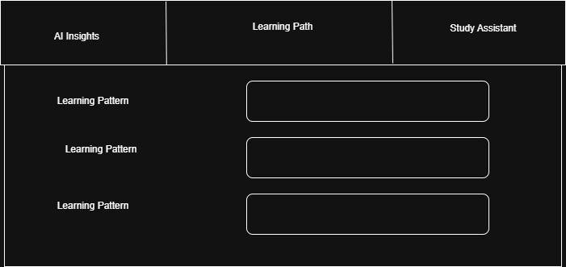
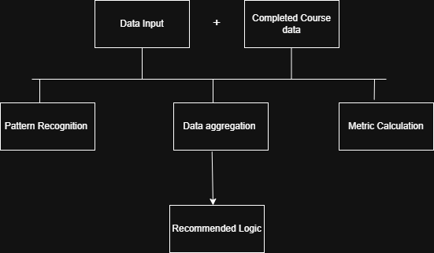

## **📝 Project Planning Document (Word File Content)**

# Scholé Learning Journey - Project Planning Document

## Executive Summary
This document outlines the comprehensive planning, architecture, and development process for the Scholé Learning Journey application. The project demonstrates modern frontend development practices while meeting all specified requirements with enhanced user experience features.

- Live Application: https://scholeai.netlify.app/

- Source Code: https://github.com/febin123/Schole.ai

## Step-by-Step Installation
### Step 1: Clone the Repository
- Clone the project from GitHub  
git clone https://github.com/febin123/Schole.ai.git

- Navigate to the project directory  
cd Schole.ai

### Step 2: Install Dependencies
 
npm install  

### Step 3: Start the Development Server
 
npm run dev  

## 1. Project Requirements Analysis

### 1.1 Core Requirements (From HR)
- Display learner's overall progress within the platform
- Distinguish between completed, ongoing, and recommended courses  
- Display learning sequence and relationships between courses
- Include interaction (filtering by date or category)

### 1.2 Enhanced Requirements (Self-Implemented)
- Quick progress update system
- Smart status transitions
- Study session tracking
- Professional UI/UX design
- Tired to include LLM(Large Language Model) & RAG(Retrieval-Augmented Generation)
- Mobile-responsive layout

## 2. Technical Architecture

| Technology | Purpose |
|------------|---------|
| React 18 | UI Framework 
| JavaScript | Programming Language 
| Tailwind CSS | Styling 
| Vite | Build Tool 

## 3. File Structure
schole-learning-journey/  
├── package.json    
├── vite.config.js   
├── tailwind.config.js  
├── postcss.config.js  
├── index.html  
└── src/  
    ├── main.jsx  
    ├── App.jsx  
    ├── styles/  
    │   └── globals.css  
    ├── data/   
    │   └── mockData.js  
    ├── hooks/  
    │   ├── useCourses.js  
    │   
    └── components/  
    │   ├── AI/                          
    │   ├── LearningPathGenerator.jsx  
    │   ├── StudyAssistant.jsx  
    │   └── LearningInsights.jsx  
        ├── Header/  
        │   ├── UserGreeting.jsx  
        │   └── OverallProgressRing.jsx  
        ├── Sidebar/  
        │   ├── index.jsx  
        │   ├── CategoryFilter.jsx  
        │   └── DateRangeFilter.jsx   
        └── Dashboard/  
            ├── ViewToggle.jsx  
            ├── CourseList/  
            │   ├── index.jsx  
            │   └── CourseCard.jsx  
            └── CourseDetails/  
                └── DetailsPanel.jsx  
## 4 . User Interface Wireframe (Frontend Focus Phase-1)

## 5. Application State flow: Phase-1

## 6 . User Interface Wireframe (Frontend Focus Phase-2)

## 7 . Application State flow: Phase-2
